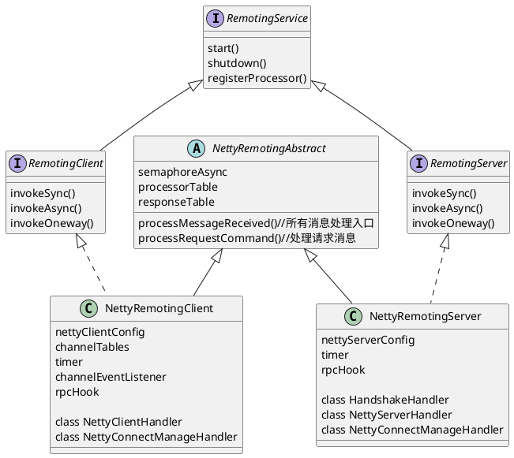
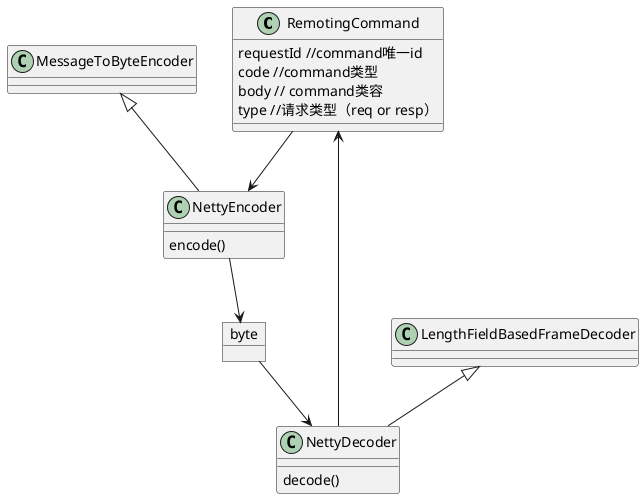
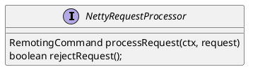
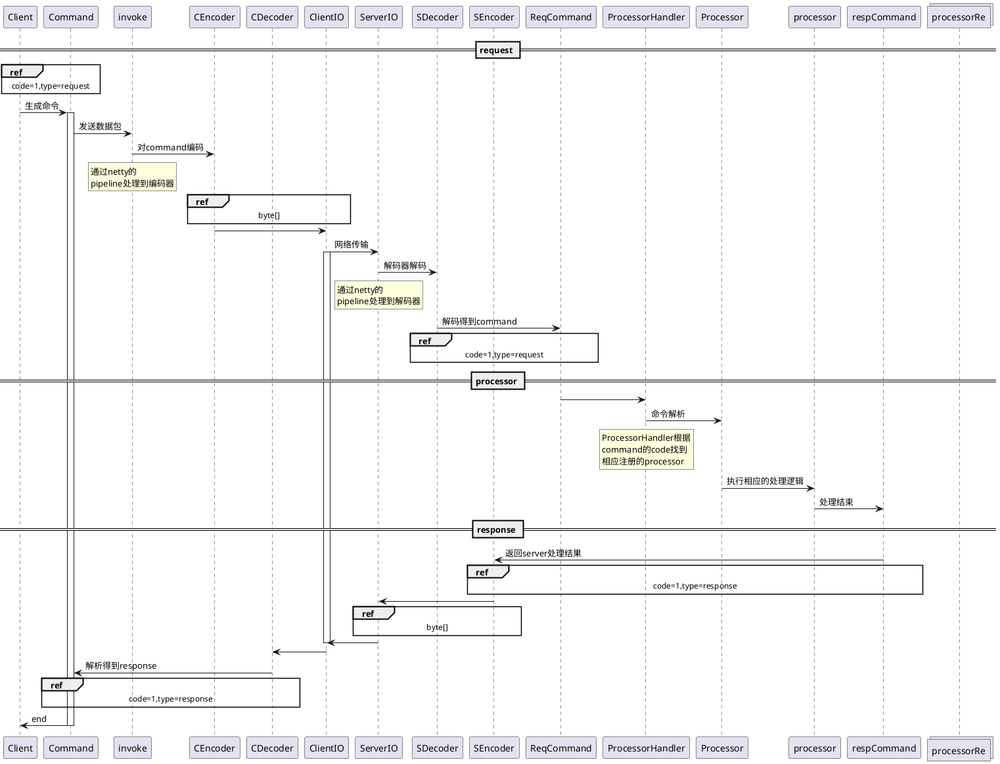

# remoting-C/S模式下简洁可靠的通信框架
### 快速使用
1. 客户端
```java
    @Test
    public void client() throws InterruptedException, RemotingTimeoutException, RemotingSendRequestException, RemotingConnectException, IOException, RemotingTooMuchRequestException {
        RemotingClient remotingClient = new NettyRemotingClient(new NettyClientConfig());
        //注册code=1消息的processor
        remotingClient.registerProcessor(1, new NettyRequestProcessor() {
            @Override
            public RemotingCommand processRequest(ChannelHandlerContext ctx, RemotingCommand request) throws Exception {
                return request;
            }

            @Override
            public boolean rejectRequest() {
                return false;
            }
        },new ThreadPoolExecutor(100,100,0, TimeUnit.MILLISECONDS,new LinkedBlockingDeque<>()));
        remotingClient.start();
        //发送一个消息code=1的消息
        RemotingCommand command = RemotingCommand.createRequestCommand(1,null);
        command.setBody("hello world".getBytes());
        //同步处理服务器响应
        System.out.println(new String(remotingClient.invokeSync("127.0.0.1:8888",command,1000).getBody()));
        command.setBody("hello world 1".getBytes());
        //异步处理服务器响应
        remotingClient.invokeAsync("127.0.0.1:8888", command, 1000, responseFuture -> System.out.println(new String(responseFuture.getResponseCommand().getBody())));
        System.in.read(new byte[1]);
    }
```
2. 服务端
```java
    @Test
    public void server() throws IOException {
        RemotingService remotingService = new NettyRemotingServer(new NettyServerConfig());
        remotingService.registerProcessor(1, new NettyRequestProcessor() {
            @Override
            public RemotingCommand processRequest(ChannelHandlerContext ctx, RemotingCommand request) throws Exception {
                //将request包改为response包
                request.markResponseType();
                System.out.println(request);
                ctx.writeAndFlush(request);
                return request;
            }

            @Override
            public boolean rejectRequest() {
                return false;
            }
        },new ThreadPoolExecutor(100,100,0,TimeUnit.MILLISECONDS,new LinkedBlockingDeque<>()));
        remotingService.start();
        System.in.read(new byte[1]);
    }
```
#### 数据包解析处理
对于数据包处理使用CQRS模式，这样使得用户对于数据处理具有高自定义性。
在定义数据处理的processor时我们需要给定processor处理的消息类型。RemotingCommand的code表明一个RemotingCommand数据包属于哪种消息类型，然后系统会根据你找到这个code码对应注册的processor进行数据处理。

### 可用，可靠性
模块完全在rocketmq的remoting模块提取。可用性，可靠性经过了rocketmq的检验。

## 基础结构图 时序图
### service管理模块


### 解码传输模块


### 处理模块

### 时序图

